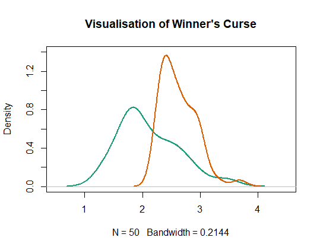

# Winner's Curse Adjustment Methods for GWAS summary statistics


<!-- badges: start -->
  [](https://github.com/amandaforde/winners_curse/actions)
  <!-- badges: end -->

$~$
$~$

This package has been designed to provide easy access to published methods which aim to correct for Winner's Curse, using GWAS summary statistics. With merely estimates of the association, `beta`, and corresponding standard error, `se`, for each SNP, this package permits users to implement adjustment methods to obtain less biased estimates of the true `beta` values. Methods can be applied to data relating to both quantitative and binary traits.


### Installation

You can install the current version of `winnerscurse` from GitHub with:

```r
# install.packages("devtools")
devtools::install_github("amandaforde/winnerscurse")
```


### Winner's Curse 

The Winner's Curse is a statistical effect resulting in the exaggeration of SNP-trait association estimates in the sample in which these associations were discovered. 

However, the Winner's Curse isn't just a phenomenon related to GWAS. An understanding of Winner's Curse may be gained through the following simple example. Consider rugby players who are ranked based on the number of points scored in one World Cup tournament. The top ranking players, the *'winners'*, are most likely players who had an above average tournament, perhaps those who were at the peak of their career and fitness. However, across many tournaments, these highly ranked players may not score as many points nor be as outstanding consistently. 

Now, let us reframe this idea in the context of GWAS. The *'winners'* here are SNPs whose effect sizes are *stochastically* higher in the discovery study than their true association values. Clearly, these raw effect estimates are therefore biased estimates of `beta`, especially for those SNPs who are ranked highly in the study - the most significant SNPs. SNPs are often ranked according to their *z*-statistics or corresponding *p*-values. 

The goal of the functions in this package is to adjust the raw effect estimates, `beta`, rendering them less biased. These adjustments are made using only the summary statistics obtained from the discovery study.  


### Simple Example

We will now provide a visual


```r
set.seed(1948)
z <- rnorm(1000,0,1)
z <- data.frame(id = 1:1000, z = z)
z <- dplyr::arrange(z, desc(abs(z)))

z_hat <- rnorm(1000,z$z,0.5)   # observed data 
z <- cbind(z, z_hat)

z <- dplyr::arrange(z, desc(abs(z_hat)))  # SNPs are arranged according to observed abs(z_hat) in descending order

plot(density(abs(z$z[1:50])),ylim=c(0,1.4),xlim=c(0.5,4.5))
lines(density(abs(z$z_hat[1:50])), col="red")
```





In visual terms, we would like our functions to produce estimates which are more in line with the true values, i.e. shifted more towards the density plot on the left, avoiding the obvious inflation incurred by the raw `z_hat` estimates here. 

**Note:** The above data is not suitable for use with the functions in this package. It has merely been used a very simple example to demonstrate the concept of winner's curse. In order to appropriately use the functions, summary statistics must be in the form of a *data frame* in which the first column, titled `rsid`, contains the SNP ID number, the second column, named `beta`, contains the effect size estimate while the third column, `se` holds the corresponding estimated standard error. 
